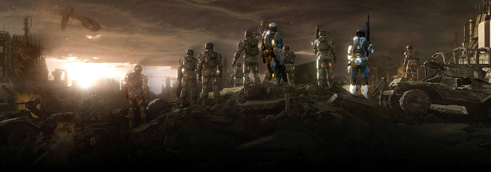

<html>           
<body>

<h1>
Heading number one Random HTML Practice
</h1>

 
Click <a href="Digital Magazine Project.pdf/">here</a> for digital magazine project.

 

Paragrpah one break   line test

Paragrpah two <b>bold</b> and <strong>strong</strong> line test

Paragraph three <i>italic</i> and <em>emphasized</em> line test

Paragraph four subscript line test

Paragraph five superscript line test

Paragrapg six <a href= "https://www.laguardia.edu">link</a> test
 
  

<body bgcolor="#95C7FF"    
    
</body>
</html>
